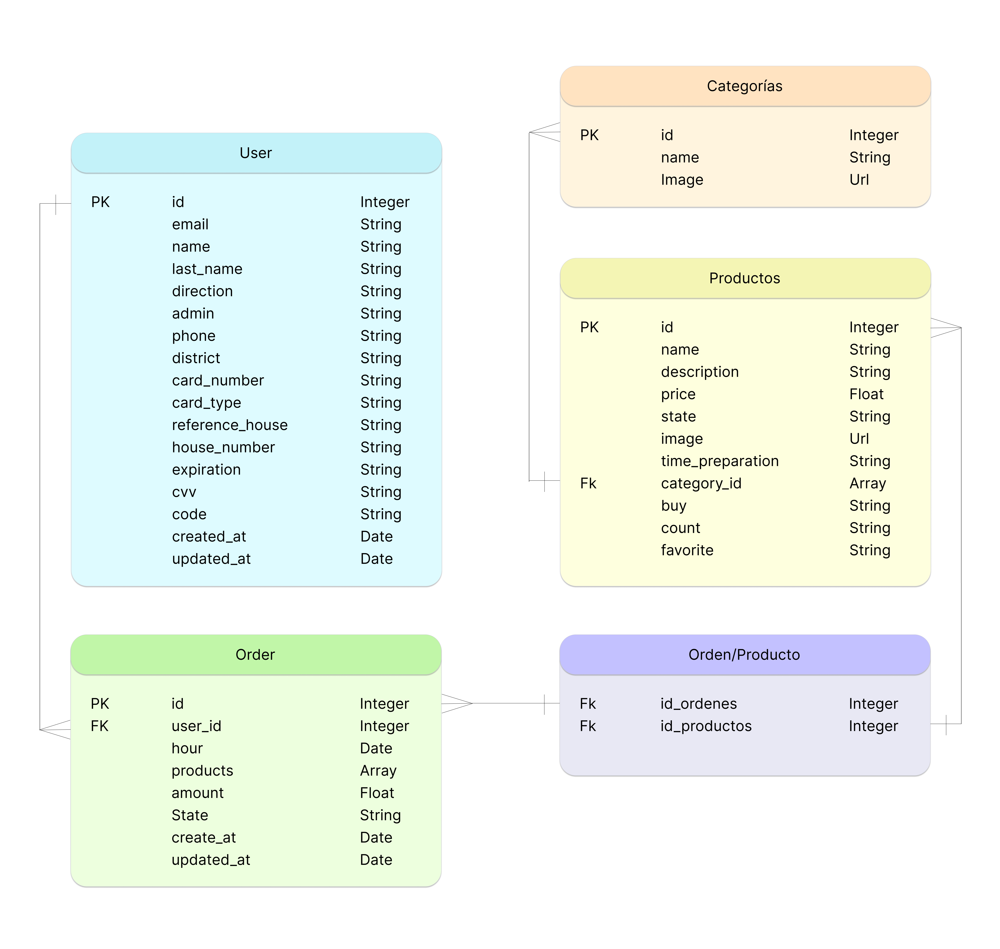
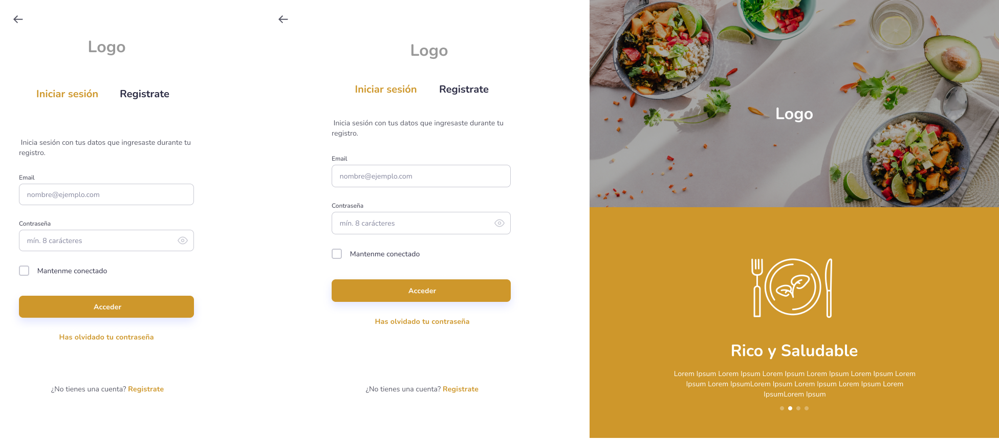
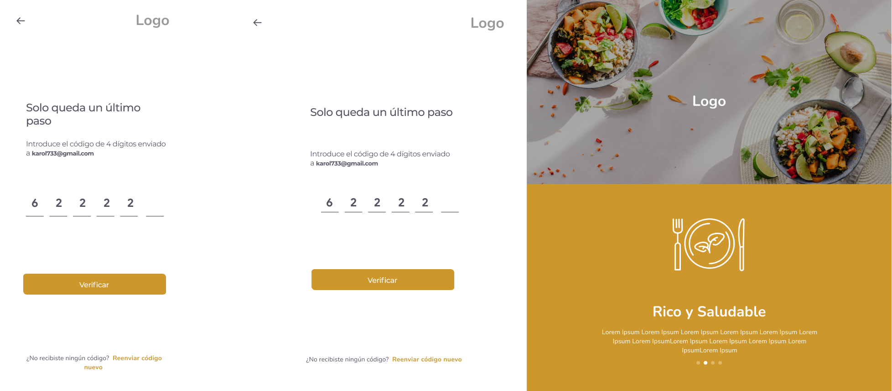
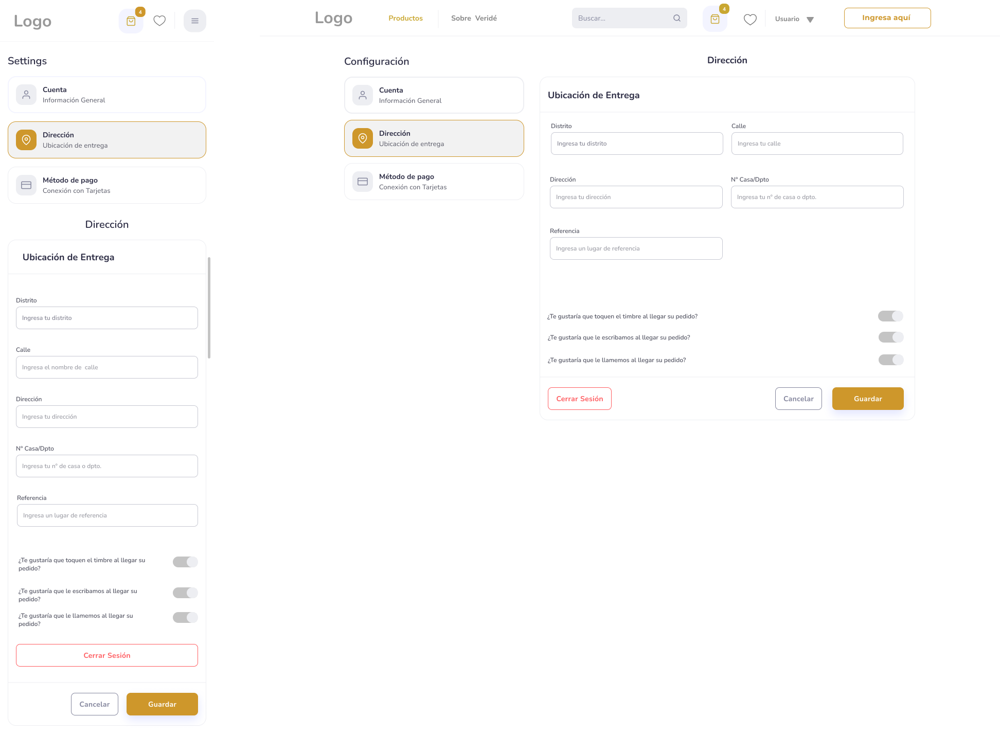
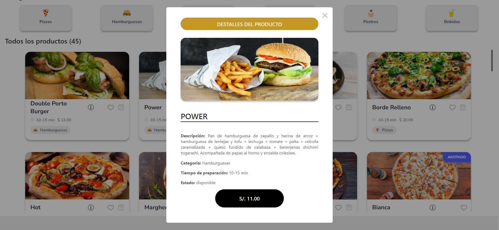
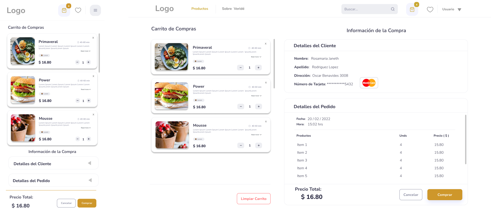
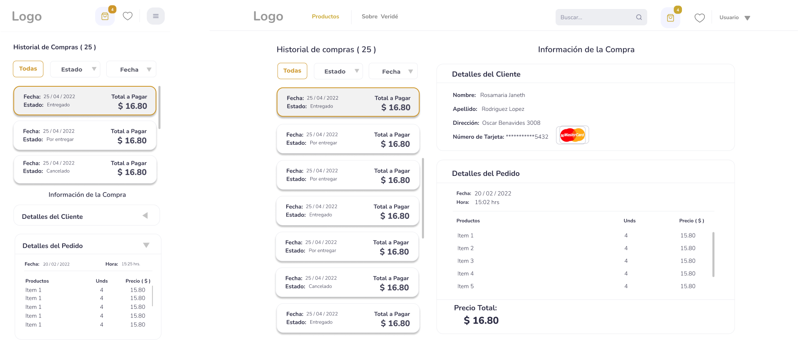

## ÍNDICE
* [1.Veridē](#1-veridē)
  - [1.1 Descripción del Proyecto](##1.1-Descripción-del-Proyecto)
  - [1.2 Descripción de Roles](##1.2-Descripción-de-Roles)
  - [1.3 Vistas según el Rol](##1.3-Vistas-según-el-Rol)
  - [1.4 Interación con la página](##1.4-Interación-con-la-página)

* [2.Estudio de Usuario](#2-Estudio-de-Usuario)
    - [2.1 Descripción general](##2.1-Descripción-general)
    - [2.2 Historias de Usuario ](##2.1-Historias-de-Usuario)

* [3.Realización del Proyecto](#3-Realización-del-Proyecto)
    - [3.1 MER](##3.1-MER)
    - [3.2 Diseño ](##2.1-Diseño)
        - [3.2.1 Wireframe ](##3.2.1-Wireframe)
        - [3.2.2 Prototipo de Alta Fidelidad ](##3.2.2-Prototipo-de-Alta-Fidelidad)
    - [3.3 Resultado Final ](##3.3-Resultado-Final)
         - [3.3.1 VideoDemostración ](##3.2.3-VideoDemostración)
         - [3.3.1 Estadísticas PWA ](##3.2.3-Estadísticas-PWA)

* [4.Tecnologías empleadas](#4-Tecnologías-empleadas)
    - [4.1 Para la Backend](##4.1-Para-la-Backend)
    - [4.2 Para el Diseño UX/UI](##4.2-Para-el-Diseño-UX/UI)
    - [4.3 Para la Frontend](##4.2-Para-la-Frontend)
    - [4.4 Para el despliegue](##4.2-Para-el-despliegue)

* [5.Autores](#5-Autores)

***

# 1. Veridē

**Veridē** es un restaurante cuyo diferenciador es ofrecer platillos vegano-vegetarianos saludables yr ecomendado por especialistas asemejándose de los platillos cotidianos en comidas rápidas como: Pizzas, hamburguesas, sushi, postres, etc. 

## 1.1  Descripción del Proyecto

El proyecto consiste en la realización de un ecommerce para el restaurante **Veridē**, enfocada para los siguientes roles: 🤵 Visitante y 👩 Usuario; con la finalidad de brindarles una herramienta que facilite sus actividades.

Constará con una vista inicial que ofrece información general de la empresa; y desde la cual se puede acceder a la sección de 'Inicio Sesión' y/o 'Registro'.

## 1.2 Descripción de Roles

| ROLES | DESCRIPCIÓN | 
|--|--| 
| 🤵 Visitante | Tendrá la opción de conocer sobre **Veridē** sin embargo deberá registrarse para tener los beneficios de un usuario.| 
| 👩 Usuario | Tendrá los beneficios de un usuario registrado, entre los mas importantes, el poder realizar el flujo de compra con seguridad. |

## 1.3  Vistas según el Rol

## 🤵 Visitante

| N° | SUB VISTAS | DESCRIPCIÓN |
|--|--|--|
| 1 | Sobre Veridē | Contiene información sobre Veridē, Sucursales, servicios, Reconocimientos y el Catálogo de Productos disponibles y agotados sin la opción de compra. |
| 2 | Inicio Sesión | Vista que contiene el formulario para el Inicio de Sesión, registro o recuperación de contraseña. |

## 👩 Usuario 

| N° | SUB VISTAS | DESCRIPCIÓN |
|--|--|--|
| 1 | Sobre Veridē | Contiene información sobre Veridē, Sucursales, servicios, Reconocimientos y el Catálogo de Productos disponibles y agotados sin la opción de compra. |
| 2 | Inicio Sesión | Vista que contiene el formulario para el Inicio de Sesión, registro o recuperación de contraseña. |
| 3 | Configuración de Cuenta | Vista que contiene los datos del usuario(Personal, Dirección y Método de Pago) y con la opción de editarlos. |
| 4 | Catálogo de Productos | Muestra todos los productos con opción de filtrado por categorías, añadir a lista de deseos o carrito de compras. |
| 5 | Lista de Deseos | Muestra los productos que fueron seleccionados como favoritos. |
| 6 | Carrito de Compras | Muestra los prodctos seleccionados para realizar una compra y los detos del usuario registrado. |
| 7 | Historial de Compras | Contiene datos básicos por cada compra que realizó el usuario. |

## 1.4  Interación con la página
Se puede acceder a la página mediante el siguiente [link](karma-burger.netlify.app/). Recordar registrarse para poder interactuar con las funcionalidades del usuario. 

***

# 2. Estudio de Usuario ✍🏼

## 2.1 Descripción general

### 🕵🏼 ¿Quienes son los principales usuarios?
Se plantearon como usuarios a todas las personas interesadas en una alimentación saludable sin alejarse de los platillos comersiales.

## 2.2 Historias de Usuario ✍

A continuación, mostraremos algunas de las historias de Usuario según el rol:

***

# 3. Realización del Proyecto

## 3.1 MER 📱

Para el flujo en la base de datos para el backend se realizó el MER (método de Entidad Relación).

## 3.2 Diseño 📱

Para el diseño, usamos la definición de  **Atomic Design** donde divide las páginas por ***átomos***, ***moléculas*** y ***organismos**. Para ello, utilizamos la plataforma **Figma** para realizar el Wireframe y prototipado de Alta Fidelidad. 

### 3.2.1 Wireframe: 📝
En esta fase se busca realizar un esquema virtual de los componentes y las vistas.

### 3.2.2 Prototipado de Alta Fidelidad: 💁🏼
Teniendo como base el Wireframe, se realiza el diseño de la web considerando estilos, paleta de colores, otros recursos.

-  [Prototipado de Alta Fidelidad en Figma](https://www.figma.com/file/C9ugIa5aFFNbmdgjC1hPhf/Untitled?node-id=2%3A2)

A continuación, le mostraremos el proceso y algunas imágenes de referencia para las siguientes secciones: 

## 📌 Landing Page: 'Sobre Veredé'

## 📌 Inicio Sesión y Registro

## 📌 Verificación de Cuenta 

## 📌 Configuración de Cuenta 

## 📌 Catálogo de Productos 

## 📌 Detalle de Productos 

## 📌 Carro de compras 

## 📌 Historial de Compras

***

## 3.3 Resultado Final 💁🏼

### 3.2.1 VideoDemostración:

A continuación, se adjuntará una breve videodemostración del resultado final tanto en diseño como en funcionalidad. 

### 3.2.2 Estadísticas PWA :

La aplicación desplegada tiene más del 80% en puntuaciones de Performance, Progressive Web App, Accessibility y Best Practices de Lighthouse.

A continuación se muestran las estadísticas del performance:

## 📌 Vista Desktop

## 📌 Vista Mobile

***

# 4. Tecnologías empleadas 👩🏾‍💻

### 4.1 Para la Backend:

-   [Ruby:](https://developer.mozilla.org/es/docs/Web/CSS)  Usada para definir el estilo visual del proyecto.

-   [Ruby on Rails:](https://developer.mozilla.org/es/docs/Web/CSS)  Usada para definir el estilo visual del proyecto.

-   [Rails Cors:](https://developer.mozilla.org/es/docs/Web/CSS)  Usada para definir el estilo visual del proyecto.

-   [Dote v:](https://developer.mozilla.org/es/docs/Web/CSS)  Usada para definir el estilo visual del proyecto.

-   [Posgresql:](https://developer.mozilla.org/es/docs/Web/CSS)  Usada para definir el estilo visual del proyecto.

## 4.2 Para el Diseño UX/UI:

-   [Figma:](https://developer.mozilla.org/es/docs/Web/CSS)  Usada para definir el estilo visual del proyecto.

-   [PostImage:](https://developer.mozilla.org/es/docs/Web/CSS)  Usada para definir el estilo visual del proyecto.

-   [Canva:](https://developer.mozilla.org/es/docs/Web/CSS)  Usada para definir el estilo visual del proyecto.

## 4.3 Para la Frontend:

-   [Sass:](https://developer.mozilla.org/es/docs/Web/CSS)  Usada para definir el estilo visual del proyecto.

-   [React.js:](https://es.reactjs.org/) Librería implementada para crear una interfaz de usuario interactiva de manera sencilla.

-   [Javascript:](https://developer.mozilla.org/es/docs/Web/JavaScript)  Para dar la funcionalidad a la plataforma.

### 4.4 Para el despliegue:

- [Heroku:](https://developer.mozilla.org/es/docs/Web/CSS)  Usada para definir el estilo visual del proyecto.

- [Netlify:](http://netlify.com) Es un servicio de hosting
para sitios web estáticos.
Para usarlo primero necesitas crear una cuenta en
Netlify y después puedes [conectar](https://www.netlify.com/blog/2016/07/22/deploy-react-apps-in-less-than-30-seconds/) tu repositorio.

- [PWA:](https://www.iebschool.com/blog/progressive-web-apps-analitica-usabilidad/) Progressive web apps (PWA) o aplicación web progresiva es una solución basada en la web tradicional que todos conocemos. 

***

# 5. Autores 📍
- [Yadira Condezo](https://github.com/)
- [Bautista Iglesias](https://github.com/)
- [Italo Ion Perez](https://github.com/)
- [Katerin Tello](https://github.com/)
- [Rosamaria Rodriguez](https://github.com/RJRCH123)

****

