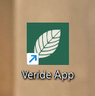
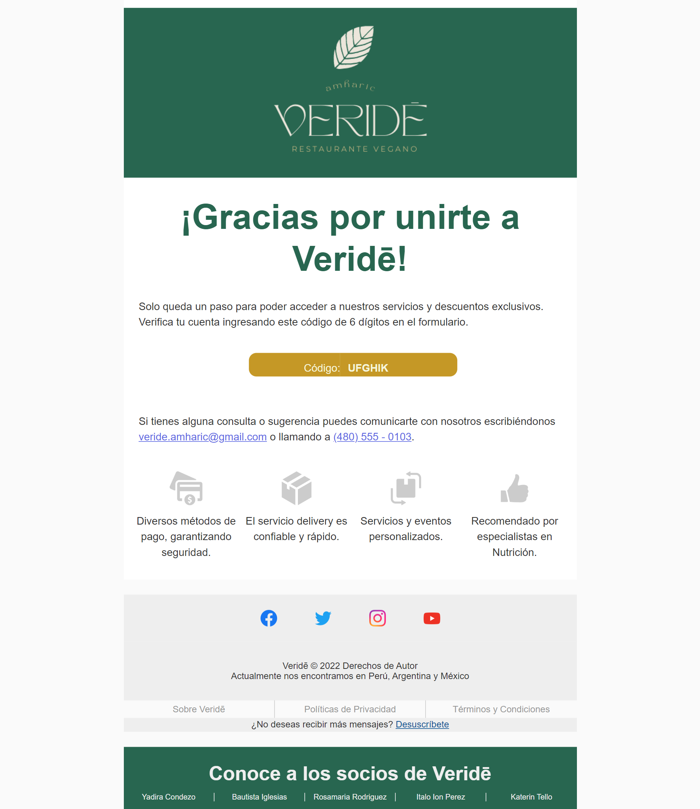
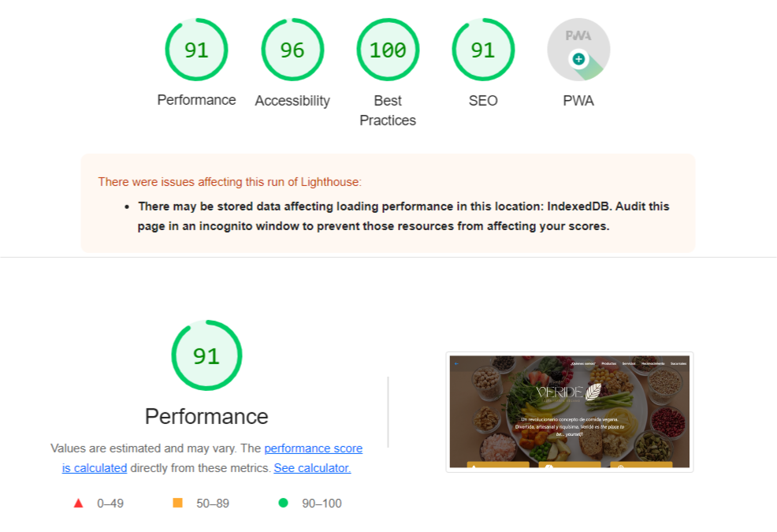
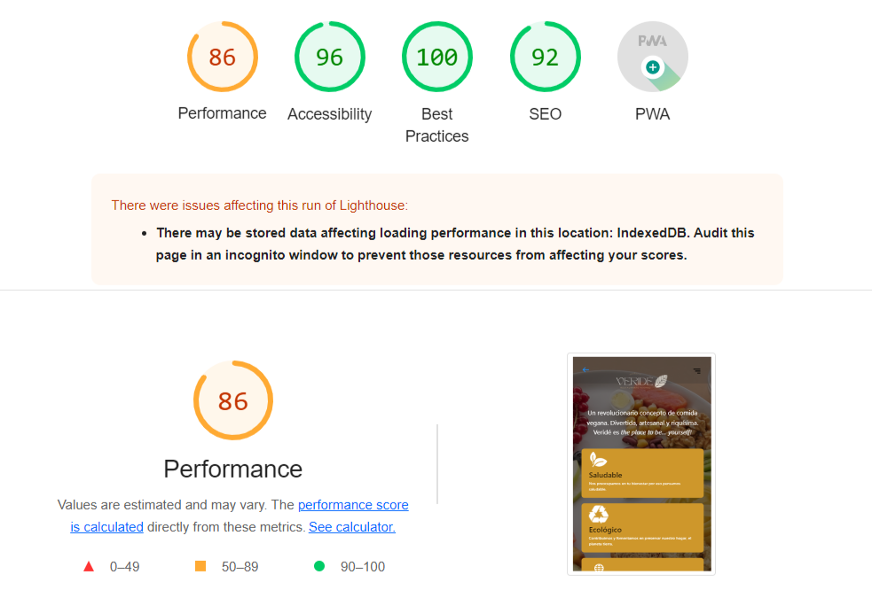

## INDEX
* [1.Veridē](#1-veridē)
  - [1.1 Project Description](##1.1-Project-Description)
  - [1.2 Role Description](##1.2-Role-Description)
  - [1.3 Views according to Role](##1.3-Views-according-to-Role)
  - [1.4 Interaction with the page](##1.4-Interaction-with-the-page)

* [2.User Study](#2-User-Study)
    - [2.1 General Description](##2.1-General-Description)
    - [2.2 User Stories ](##2.1-User-Stories)

* [3.Project implementation](#3-Project-implementation)
    - [3.1 MER](##3.1-MER)
    - [3.2 Design ](##2.1-Design)
        - [3.2.1 Wireframe ](##3.2.1-Wireframe)
        - [3.2.2 High Fidelity Prototype ](##3.2.2-High-Fidelity-Prototype)
    - [3.3 Final Result ](##3.3-Final-Result)
         - [3.3.1 VideoDemo ](##3.2.3-VideoDemo)
         - [3.3.1 PWA statistics ](##3.2.3-PWA-statistics)

* [4.Technologies used](#4-Tecnologías-empleadas)
    - [4.1 For Backend](##4.1-For-Backend)
    - [4.2 For UX/UI](##4.2-For-UX/UI)
    - [4.3 For Frontend](##4.2-For-Frontend)
    - [4.4 For deploy](##4.2-For-deploy)
    - [4.5 For organization](##4.5-For-organization)

* [5.Authors](#5-Authors)

***

# 1. Veridē

**Veridē** is a restaurant whose differentiator is to offer healthy vegan-vegetarian dishes recommended by nutrition specialists; resembling everyday fast food dishes such as: pizzas, hamburgers, sushi, desserts, etc. 

## 1.1 Project Description

The project consists of the realization of an ecommerce for the restaurant **Veridē**, focused for the following roles: 🤵 Visitor and 👩 User; in order to provide them with a tool that facilitates their activities.

It will consist of an initial view that offers general information about the company; and from which you can access the 'Login' and/or 'Register' section.

| VIDEODEMO |  
|--|
|  [Link de Youtube](https://www.youtube.com/watch?v=SdN3ATBP80g) |

| DEMO |  
|--|
|  [Link del Despliegue](https://veride.netlify.app/) |

## 1.2 Role Description

| ROLES | DESCRIPTION | 
|--|--| 
| 🤵 Visitor | You will have the option to learn about **Veridē** however you will need to register to have the benefits of a user. | 
| 👩 User | You will have the benefits of a registered user, among the most important, being able to make the purchase flow with security. |

## 1.3  Views according to Role

## 🤵 Visitor

| N° | SUB VISTAS | DESCRIPCIÓN |
|--|--|--|
| 1 | Sobre Veridē | Contiene información sobre Veridē, Sucursales, servicios, Reconocimientos y el Catálogo de Productos disponibles y agotados sin la opción de compra. |
| 2 | Inicio Sesión | Vista que contiene el formulario para el Inicio de Sesión, registro o recuperación de contraseña. |

## 👩 Usuario 

| N° | SUB VISTAS | DESCRIPCIÓN |
|--|--|--|
| 1 | Sobre Veridē | Contiene información sobre Veridē, Sucursales, servicios, Reconocimientos y el Catálogo de Productos disponibles y agotados sin la opción de compra. |
| 2 | Inicio Sesión | Vista que contiene el formulario para el Inicio de Sesión, registro o recuperación de contraseña. |
| 3 | Configuración de Cuenta | Vista que contiene los datos del usuario(Personal, Dirección y Método de Pago) y con la opción de editarlos. |
| 4 | Catálogo de Productos | Muestra todos los productos con opción de filtrado por categorías, añadir a lista de deseos o carrito de compras. |
| 5 | Lista de Deseos | Muestra los productos que fueron seleccionados como favoritos. |
| 6 | Carrito de Compras | Muestra los prodctos seleccionados para realizar una compra y los detos del usuario registrado. |
| 7 | Historial de Compras | Contiene datos básicos por cada compra que realizó el usuario. |

## 1.4  Interación con la página

|  PÁGINA WEB | DESCARGABLE (PWA) |
|--|--| 
| Se puede acceder a la página mediante el siguiente link. Recordar registrarse para poder interactuar con las funcionalidades del usuario. | Además, tiene la opción de descargase como PWA en cualquier dispositivo.|
| [https://veride.netlify.app](https://veride.netlify.app/)| |

***

# 2. Estudio de Usuario ✍🏼

## 2.1 Descripción general

### 🕵🏼 ¿Quienes son los principales usuarios?
Se plantearon como usuarios a todas las personas interesadas en una alimentación saludable sin alejarse de los platillos comersiales.

## 2.2 Historias de Usuario ✍

Para acceder a las historias de usuario y los criterios de aceptación para cada rol, por favor, puede acceder a [Este Link](https://www.figma.com/file/C9ugIa5aFFNbmdgjC1hPhf/Untitled?node-id=2%3A3)

***

# 3. Realización del Proyecto

## 3.1 MER 📱

Para el flujo en la base de datos para el backend se realizó el MER (método de Entidad Relación).

## 3.2 Diseño 📱

Para el diseño, usamos la definición de  **Atomic Design** donde divide las páginas por ***átomos***, ***moléculas*** y ***organismos**. Para ello, utilizamos la plataforma **Figma** para realizar el Wireframe y prototipado de Alta Fidelidad. 

### 3.2.1 Wireframe: 📝
En esta fase se busca realizar un esquema virtual de los componentes y las vistas.

### 3.2.2 Prototipado de Alta Fidelidad: 💁🏼
Teniendo como base el Wireframe, se realiza el diseño de la web considerando estilos, paleta de colores, otros recursos.

-  [Prototipado de Alta Fidelidad en Figma](https://www.figma.com/file/C9ugIa5aFFNbmdgjC1hPhf/Untitled?node-id=2%3A2)

A continuación, le mostraremos el proceso y algunas imágenes de referencia para las siguientes secciones: 

## 📌 Landing Page: 'Sobre Veredé'

## 📌 Inicio Sesión y Registro

## 📌 Verificación de Cuenta 

## 📌 Maquetación enviada al correo electrónico para el 'Código de verificación'

## 📌 Configuración de Cuenta 

## 📌 Catálogo de Productos 

## 📌 Detalle de Productos 

## 📌 Carro de compras 

## 📌 Historial de Compras

***

## 3.3 Resultado Final 💁🏼

### 3.2.1 VideoDemostración:

A continuación, se adjuntará una breve [videodemostración](https://www.youtube.com/watch?v=SdN3ATBP80g) del resultado final tanto en diseño como en funcionalidad. 

### 3.2.2 Estadísticas PWA :

La aplicación desplegada tiene más del 80% en puntuaciones de Performance, Progressive Web App, Accessibility y Best Practices de Lighthouse.

A continuación se muestran las estadísticas del performance:

## 📌 Vista Desktop

## 📌 Vista Mobile

***

# 4. Tecnologías empleadas 👩🏾‍💻

### 4.1 Para el Backend:

- [Ruby:]()El lenguaje Ruby se utiliza principalmente en el desarrollo de aplicaciones web, pero también se puede utilizar para desarrollar otro tipo de aplicaciones de software, como veremos más adelante. Este lenguaje está disponible en plataformas como Windows, Linux y muchas otras, considerándose multiplataforma.

- [Ruby on Rails:]() Ruby on Rails es un marco de trabajo (framework) para el desarrollo de aplicaciones web, escrito en el leguaje de programación Ruby. Ruby es un lenguaje dinámico orientado a objetos, con sintaxis inspirada en Python, Perl y Smalltalk.

- [Rails Cors:]()   El Intercambio de Recursos de Origen Cruzado (CORS (en-US)) es un mecanismo que utiliza cabeceras HTTP adicionales para permitir que un user agent (en-US) obtenga permiso para acceder a recursos seleccionados desde un servidor, en un origen distinto (dominio) al que pertenece.

- [PostgreSQL:]()  Consiste en un gestor de bases de datos relacionales, soporta diferentes tipos de datos y está orientado a objetos. Es de código abierto, es decir, cuentan con una comunidad de desarrolladores que implementan mejoras o resuelven errores de forma altruista.

## 4.2 Para el Diseño UX/UI:

-   [Figma:](https://www.figma.com/)  Figma es una aplicación basada en navegador para diseñar UI y UX que cuenta con excelentes herramientas de diseño, creación de prototipos y generación de código.

-   [PostImage:](https://postimages.org/)  Esta es simplemente una de las mejores soluciones que le permite alojar todo tipo de imágenes para sitios web, blogs y otras interfaces en el sitio web.

## 4.3 Para el Frontend:

-   [Sass:](https://developer.mozilla.org/es/docs/Web/CSS)  Usada para definir el estilo visual del proyecto.

-   [React.js:](https://es.reactjs.org/) Librería implementada para crear una interfaz de usuario interactiva de manera sencilla.

-   [Javascript:](https://developer.mozilla.org/es/docs/Web/JavaScript)  Para dar la funcionalidad a la plataforma.

### 4.4 Para el despliegue:

- [Heroku:](https://www.heroku.com/)  Heroku integra servicios de datos y un ecosistema que permite implementar y ejecutar aplicaciones modernas. Proporciona a los desarrolladores un enfoque centrado en la aplicación que se integra con las herramientas y flujos de trabajo de desarrolladores más populares.

- [Netlify:](http://netlify.com) Es un servicio de hosting
para sitios web estáticos.
Para usarlo primero necesitas crear una cuenta en
Netlify y después puedes [conectar](https://www.netlify.com/blog/2016/07/22/deploy-react-apps-in-less-than-30-seconds/) tu repositorio.

- [PWA:](https://www.iebschool.com/blog/progressive-web-apps-analitica-usabilidad/) Progressive web apps (PWA) o aplicación web progresiva es una solución basada en la web tradicional que todos conocemos. 

### 4.4 Para la organización:

- [Trello]()

- [GitHub Projects]()

***

# 5. Autores 📍

- [Yadira Condezo](https://github.com/bluezin): Backend y Frontend
- [Bautista Iglesias](https://github.com/Baut1): Frontend
- [Italo Ion Perez](https://github.com/storres20): Frontend
- [Katerin Tello](https://github.com/KaterinT): Frontend
- [Rosamaria Rodriguez](https://github.com/RJRCH123): Diseñadora UX/UI y Frontend

****

